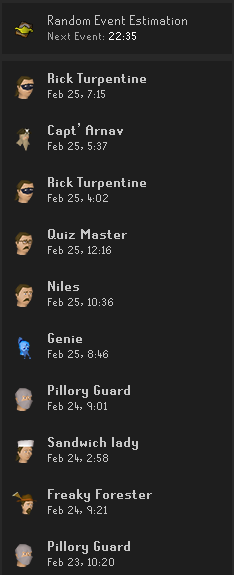

# Random Event Analytics

This plugin logs the random events the player receives and attempts to provide an accurate estimation of when the next random should occur.

## Estimation:
For now, the estimation provided in this plugin is a simple 1 hour timer. Eventually once enough data has been collected the timer will be a function of player, client, and environment attributes to give a more accurate estimate.

## Panel & Overlay:

## Data Points:
When a random event occurs, multiple data points will be collected. For example:
- Local time the random event was spawned.
- NPC and Player Local and World Location
- Overall and maximum XP/hr
- Overall and maximum Actions/hr

To see a full list of data points, please view the [Record](src/main/java/com/randomEventAnalytics/localstorage) files.