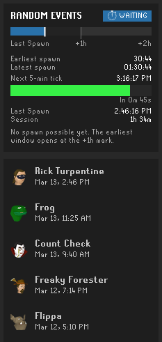
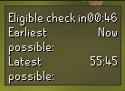

# Random Event Analytics

This plugin logs the random events the player receives and attempts to provide an hour of estimation until the next random event.

## Estimation:

Random Events spawn every 1 - 2 hours (since the last spawn) in real-time. A check is made every 5 minutes of logged-in time to determine if the player is eligible. See https://github.com/zmanowar/random-event-analytics/issues/3 and the [Random Events OSRS Wiki Page](https://oldschool.runescape.wiki/w/Random_events#Spawn_mechanics) for more information.

## Panel & Overlay:

The panel features a progress bar representing the next spawn window, a countdown and a progress bar that fills every 5 minutes of logged-in time, and a list of previously spawned randoms.

Hovering over the random events will show more metadata about the event.

The overlay displays a countdown until the next eligible spawn window.

## Data Points:

When a random event occurs, multiple data points will be collected. For example:

- Local time the random event was spawned.
- NPC and Player Local and World Location
- Overall and maximum XP/hr
- Overall and maximum Actions/hr

To see a full list of data points, please view the [Record](src/main/java/com/randomEventAnalytics/localstorage) files.
